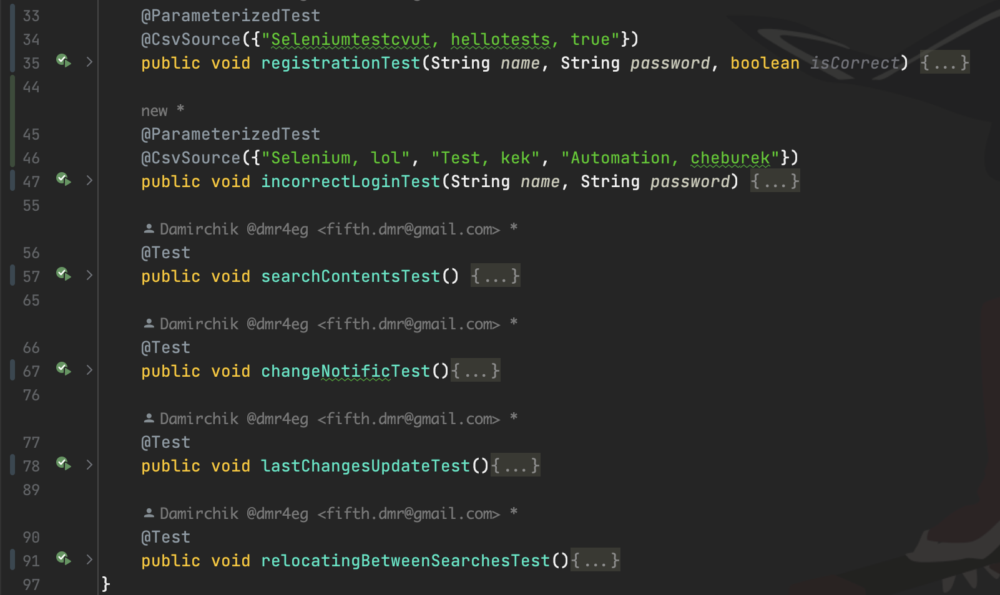
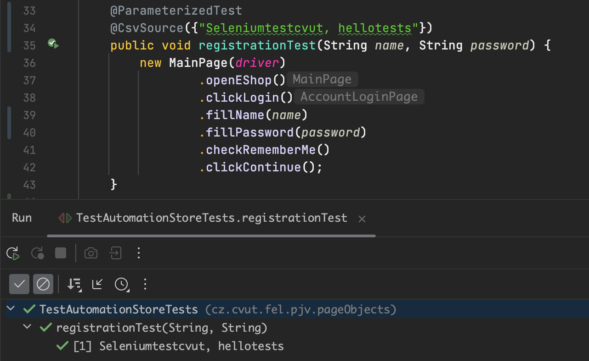
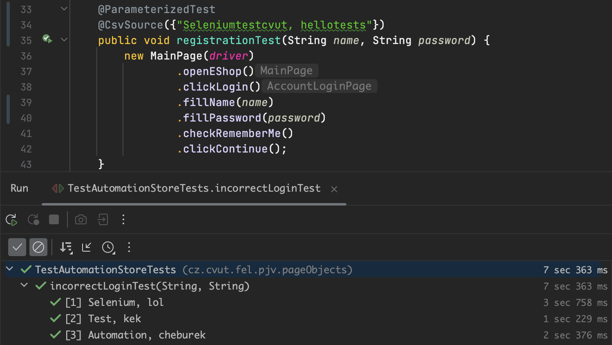
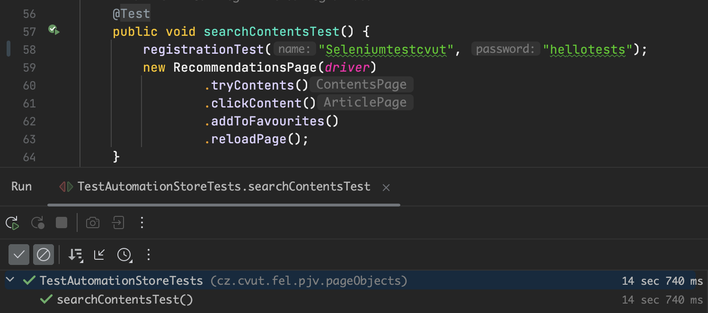
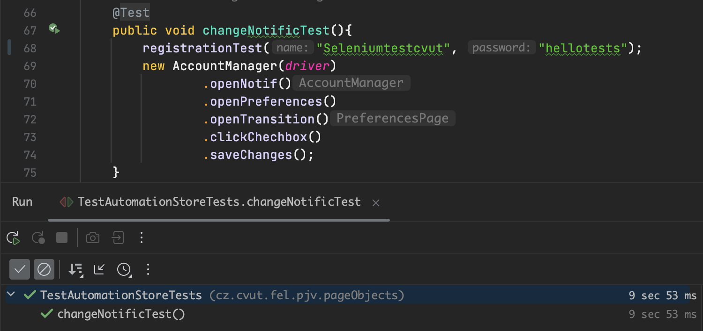
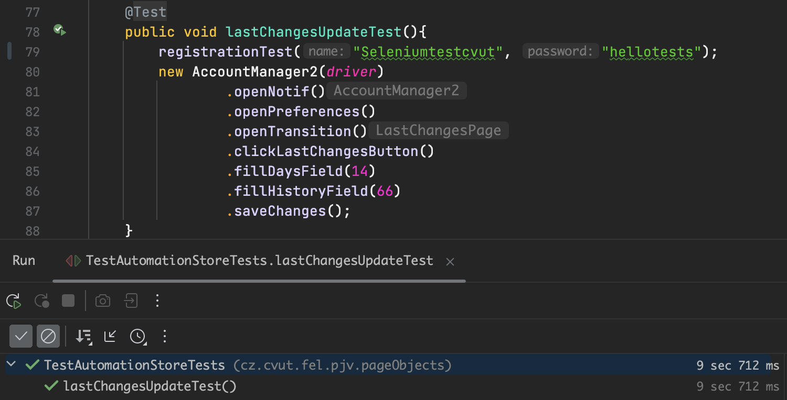
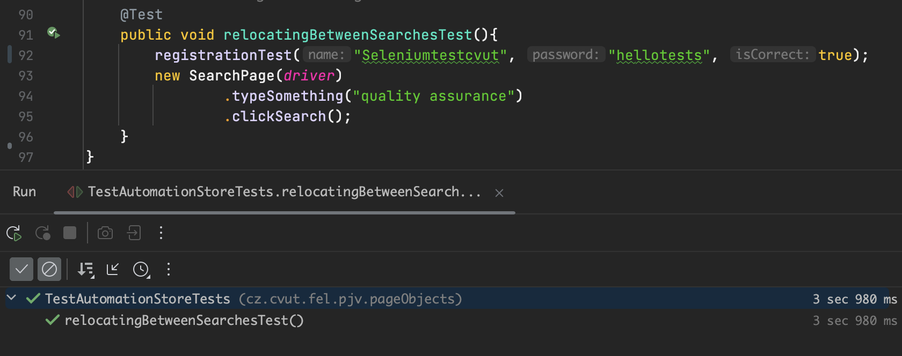

# wikiTesting
## Selenium testing of online Encyclopedia known as Wikipedia. Those tests cover all main functionality of a service - browsing throught articles/pages, seraching specific information, managing personal account and editing existing articles. All tests are structured as "Page Object Models" and easy to work on. I used Safari WebDriver for generating automatic tests. 

###  Here are some console results of tests:

--

--

--

--

--

--

